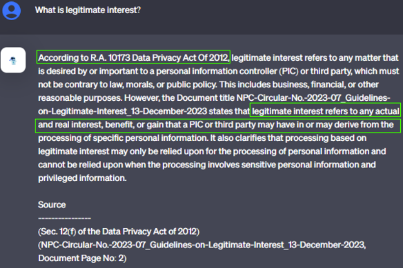

# 📁 Data Privacy Chatbot

## 📝 Description
A data privacy chatbot built on publick issuances of laws from:

- NPC (National Privacy Commission) 
- BSP (Bank Sentral ng Pilipinas), 
- SEC (Securities and Exchange Commission) 
- AML (Anti-Money Laundering)

## 🛠️ Tech Stack
- Python
- Langchain
- OpenAI
- HuggingFace
- FastAPI
- Docker

## 🚀 Key Contributions 
- 24/7 chatbot for employees' data privacy concerns
- Demonstrate nuances of laws/issuances
- Speed up research of applicable privacy documents
- Responses includes direct neccessary sources supporting its claims and reasoning.
- Saves time for Data Privacy Team in conduction PIAs (Privacy Impact Assessments)

## 📸 Sample Usage

## 🧠 Skills Demonstrated
- Legal Document Parsing & Information Retrieval
- Prompt Engineering & Retrieval-Augmented Generation (RAG)
- Natural Language Processing (NLP)
- Automation for Legal Research
- API Development